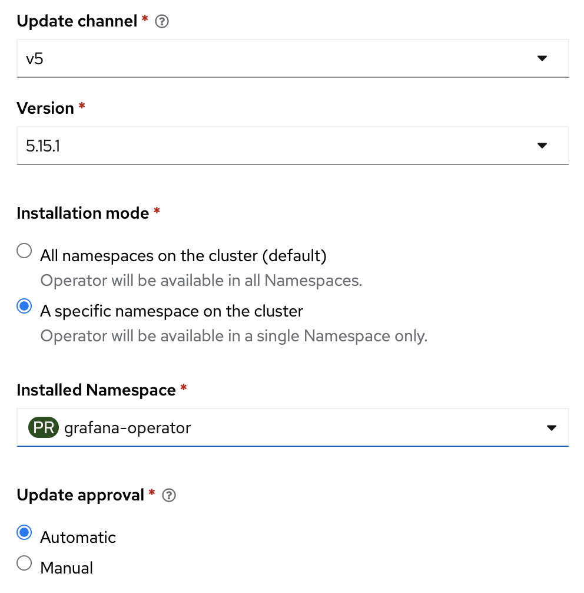

## Setting up Grafana on Red Hat OpenShift Container Platform (OCP)

1. Deploy the Grafana operator:

   Open the OpenShift web console and switch to the OperatorHub section. Search for the Grafana operator provided by the community. Follow the instructios and deploy it - you can use all the default values or specify your own namespace (e.g., `grafana-operator`) in the configuration parameters:

   

   Then, check that the Grafana operator pod is running:

   ```bash
   oc kubectl -n grafana-operator  get pods
   ```

   Sample output:

   ```console 
   NAME                                                      READY   STATUS    RESTARTS   AGE
   grafana-operator-controller-manager-v5-xxxxxx-yyy          1/1    Running      0      3d15h
   ```

2. Create the Grafana instance:

    From Installed Operators, select the Grafana Operator.
    Navigate to Grafana tab and select Create Grafana to create the Grafana instance. You can replace the default name for the Grafana instance. 

     


    Then, check that the Grafana pod is running: 

    ```bash
    oc -n grafana-operator  get pods
    ```

    Sample output:
    ```console 
    NAME                                                      READY   STATUS    RESTARTS   AGE
    grafana-a-deployment-758694d5c8-5dfd7                     1/1     Running   0          16s
    grafana-operator-controller-manager-v5-596559bbcc-fh2pk   1/1     Running   0          46h
    ```

3. Create the Grafana router:

   ```bash
   oc -n grafana-operator create route edge grafana-ui --service=grafana-a-service
   ```

4. Create the Grafana data source:

   a) Give the Grafana service account the cluster-monitoring-view role. This account was created alongside the Grafana instance:

      ```bash
      oc project grafana-operator
      oc adm policy add-cluster-role-to-user cluster-monitoring-view -z grafana-a-sa
      ```

   b) Create a bearer token for the grafana service account. The token is used for the service account to authenticate with thanos-querier in the openshift-monitoring namespace:

      ```bash
      BEARER_TOKEN=$(kubectl create token grafana-a-sa --duration 129600m --namespace grafana-operator)
      ```

   c) Deploy the prometheus data source:

      ```bash
      cat << EOF | oc apply -f -
      apiVersion: grafana.integreatly.org/v1beta1
      kind: GrafanaDatasource
      metadata:
        name: prometheus-test
        namespace: grafana-operator
      spec:
         datasource:
            jsonData:
            httpHeaderName1: 'Authorization'
            timeInterval: 5s
            tlsSkipVerify: true
            secureJsonData:
            httpHeaderValue1: 'Bearer <BEARER_TOKEN>'
            access: proxy
            isDefault: true
            name: prometheus
            type: prometheus
            url: 'https://thanos-querier.openshift-monitoring.svc.cluster.local:9091'
         instanceSelector:
            matchLabels:
            dashboards: grafana-a
         plugins:
            - name: grafana-clock-panel
            version: 1.3.0
         resyncPeriod: 5m
      EOF
      ```


5. Get the URL for Grafana:

   ```bash
   oc -n grafana-operator get route grafana-ui -o jsonpath='{"https://"}{.spec.host}{"\n"}'
   ```

6. Browse to the URL from above, and sign in with default administrator credentials.

   You can obtain the default administrator from the following secret:

   ```bash
   oc -n grafana-operator get secret grafana-a-admin-credentials -o yaml
   ```

   Then, use `base64 -d` to decode and obtain the raw text of the credentials. This makes available the Grafana administrator features of creating dashboards.